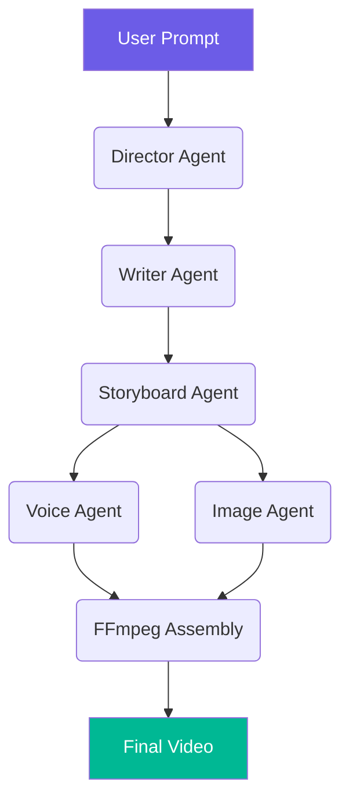

# AutoForge AI

> An autonomous AI-powered video production system that transforms a simple story idea into a complete video using multi-agent collaboration.

## How Codex & GPT-4o Are Used

- **GPT-4o:** Central reasoning engine for Director and Storyboard agents — parses raw prompts, constructs narratives, maintains character consistency across scenes.
- **Codex:** Used during development for backend boilerplate, FFmpeg pipeline refinement, and multi-agent orchestration debugging.

## System Architecture



**Real-time progress** is streamed via WebSocket. Frontend displays each pipeline stage as it completes.

## Quick Start

```bash
# Prerequisites: Python 3.10+, FFmpeg
# macOS:   brew install ffmpeg
# Ubuntu:  sudo apt install ffmpeg

python -m venv .venv
source .venv/bin/activate
pip install -r requirements.txt
cp .env.example .env   # fill in your OPENAI_API_KEY

uvicorn src.main:app --reload
```

Open **http://localhost:8000** for the demo UI.

## API Endpoints

| Method | Endpoint | Description |
|--------|----------|-------------|
| `POST` | `/api/projects` | Submit a story idea (returns 202 + project_id) |
| `GET` | `/api/projects/{id}` | Poll project status |
| `GET` | `/api/projects/{id}/video` | Download final video |
| `GET` | `/api/projects/{id}/assets/{file}` | Get generated image/audio |
| `WS` | `/ws/{id}` | Real-time pipeline progress |

### Example

```bash
# Submit
curl -X POST http://localhost:8000/api/projects \
  -H "Content-Type: application/json" \
  -d '{"idea": "A robot discovers emotions in a post-apocalyptic garden"}'

# Poll status
curl http://localhost:8000/api/projects/<project_id>

# Download video
curl -O http://localhost:8000/api/projects/<project_id>/video
```

## Project Structure

```
src/
├── main.py              # FastAPI app + WebSocket + static serving
├── config.py            # Pydantic settings
├── openai_client.py     # AsyncOpenAI singleton
├── pipeline.py          # 5-stage orchestrator
├── ws.py                # WebSocket progress broadcast
├── utils.py             # JSON parsing + retry decorator
├── static/
│   └── index.html       # Demo frontend
├── api/
│   └── routes.py        # REST endpoints
└── agents/
    ├── director.py      # Idea → production plan (GPT-4o)
    ├── writer.py        # Plan → script with dialogue
    ├── storyboard.py    # Script → shot breakdown
    └── media.py         # Voice (TTS) + Image (DALL-E 3)
```

## Tech Stack

- **FastAPI** + Pydantic v2 — async API framework
- **OpenAI GPT-4o** — narrative reasoning engine
- **OpenAI TTS** — voice synthesis (tone-mapped: onyx/nova/fable/alloy)
- **DALL-E 3** — image generation
- **FFmpeg** — video assembly
- **WebSockets** — real-time progress streaming
