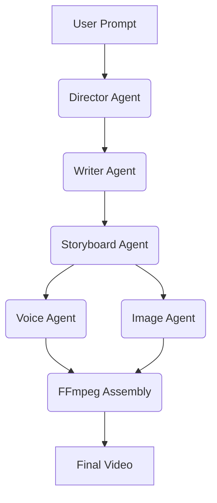

# AutoForge AI

> An autonomous AI-powered video production system that transforms a simple story idea into a complete video using multi-agent collaboration.

## 🧠 How Codex & GPT-4o Are Used
- **GPT-4o:** Acts as the central reasoning engine for our multi-agent system. It is utilized by the Director and Storyboard agents to parse raw user prompts, construct complex narrative structures, and maintain long-context character consistency across scenes.
- **Codex:** Heavily utilized during the development phase to accelerate the generation of the Python backend boilerplate, refine the async FFmpeg video processing pipeline, and debug the multi-agent orchestration logic.

## System Architecture

Multi-agent workflow consisting of Director, Writer, Storyboard, Voice, and Image generation agents, coordinated to output structured video assets for FFmpeg assembly.



## Prerequisites

- **Python 3.10+**
- **FFmpeg** — required for video assembly (system-level dependency)

```bash
# macOS
brew install ffmpeg

# Ubuntu / Debian
sudo apt install ffmpeg
```

## Quick Start
```bash
python -m venv .venv
source .venv/bin/activate
pip install -r requirements.txt
cp .env.example .env
```
