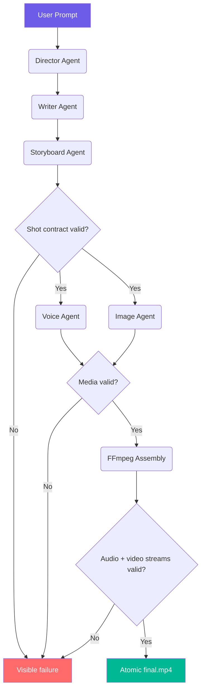

# AutoForge Classroom

> A judge-ready, standalone video production pipeline that transforms one idea
> into a planned, narrated, illustrated, and validated MP4.

This repository is the public judging edition. It is intentionally **not a SaaS
platform**: authentication, billing, multi-tenancy, private provider adapters,
local model runtimes, private assets, and workstation configuration are outside
its scope. The included code is sufficient to inspect and run the core product
experience.

## How Codex & GPT-5.6 Terra Are Used

- **GPT-5.6 Terra** is the default text model for the Director, Writer, and
  Storyboard agents. It turns the initial idea into three inspectable,
  structured JSON artifacts before media generation begins.
- **Codex** was used to harden the public build: implement provider-neutral
  reliability code, connect durable project state, validate generated media,
  fix real-duration FFmpeg composition, and add regression tests.
- **OpenAI TTS and DALL-E 3** generate the narration and frames. Their outputs
  are validated before they can be published or assembled.

The runtime model is explicit and configurable:

```dotenv
OPENAI_MODEL=gpt-5.6-terra
```

## System Architecture



Real-time progress is streamed via WebSocket, with status polling as a fallback.
Project state is saved beside its assets, so a process restart produces an
explicit `interrupted` result instead of silently losing work.

### Reliability layer

- Storyboards are structurally validated before paid media calls begin.
- Downloads must return an image content type and decode as a real image.
- Audio, images, intermediate clips, and the final MP4 must be non-empty and
  valid for their media type.
- FFmpeg failures include bounded diagnostic output and cannot be reported as
  success.
- Shot duration is derived from the actual narration, preventing clipped audio.
- Completed media and JSON state are published atomically.
- Project IDs and asset paths are contained within the configured output root.
- Public API errors redact credentials, signed query strings, and local paths.

## Quick Start

```bash
# Prerequisites: Python 3.10+, FFmpeg + ffprobe
# macOS:   brew install ffmpeg
# Ubuntu:  sudo apt install ffmpeg

python -m venv .venv
source .venv/bin/activate
pip install -r requirements.txt
cp .env.example .env   # fill in your OPENAI_API_KEY

uvicorn src.main:app --reload
```

Open **http://localhost:8000** for the demo UI.

Judges can click **Try Sample Lesson** to exercise the complete persistence,
media-validation, progress, and FFmpeg path without a live provider credential
or paid provider call. The UI labels this deterministic path explicitly;
**Generate Lesson** uses the live GPT-5.6, TTS, and image workflow.

Run the complete test suite:

```bash
pip install -r requirements-dev.txt
pytest -q
```

## API Endpoints

| Method | Endpoint | Description |
|--------|----------|-------------|
| `POST` | `/api/projects` | Submit a story idea (returns 202 + project_id) |
| `GET` | `/api/projects/{id}` | Poll project status |
| `GET` | `/api/projects/{id}/video` | Download final video |
| `GET` | `/api/projects/{id}/assets/{file}` | Get generated image/audio |
| `WS` | `/ws/{id}` | Real-time pipeline progress |

### Example

```bash
# Submit
curl -X POST http://localhost:8000/api/projects \
  -H "Content-Type: application/json" \
  -d '{"idea": "A robot discovers emotions in a post-apocalyptic garden"}'

# Poll status
curl http://localhost:8000/api/projects/<project_id>

# Download video
curl -O http://localhost:8000/api/projects/<project_id>/video
```

## Project Structure

```
src/
├── main.py              # FastAPI app + WebSocket + static serving
├── config.py            # Pydantic settings
├── openai_client.py     # AsyncOpenAI singleton
├── pipeline.py          # 5-stage orchestrator
├── ws.py                # WebSocket progress broadcast
├── utils.py             # JSON parsing + retry decorator
├── core/
│   ├── file_protocol.py # locks, contained paths, atomic JSON
│   └── media_integrity.py # shot/media validation + safe errors
├── repositories/
│   └── project_repository.py # durable local project lifecycle
├── services/
│   └── ffmpeg_service.py # checked, real-duration video assembly
├── static/
│   └── index.html       # Demo frontend
├── api/
│   └── routes.py        # REST endpoints
└── agents/
    ├── director.py      # Idea → production plan (GPT-5.6 Terra)
    ├── writer.py        # Plan → script with dialogue
    ├── storyboard.py    # Script → shot breakdown
    └── media.py         # Voice (TTS) + Image (DALL-E 3)
```

## Tech Stack

- **FastAPI** + Pydantic v2 — async API framework
- **OpenAI GPT-5.6 Terra** — structured narrative reasoning
- **OpenAI TTS** — voice synthesis (tone-mapped: onyx/nova/fable/alloy)
- **DALL-E 3** — image generation
- **FFmpeg + ffprobe** — checked video assembly and stream validation
- **Pillow** — full image decoding and validation
- **WebSockets** — real-time progress streaming

## Public Boundary

This repository has no runtime imports, Git remotes, submodules, environment
references, or asset dependencies pointing to another project. The reliability
layer is provider-neutral and contains no credentials, generated media, private
prompts, private provider code, or machine-specific paths.

## Build Week Scope

The pre-existing prototype contained the basic FastAPI application, general
multi-agent idea-to-video sequence, OpenAI wrappers, simple progress UI, and
direct FFmpeg assembly.

During Build Week, Codex was used to add the Education-focused product
experience, explicit GPT-5.6 Terra reasoning path, durable state, path
containment, structural shot validation, decoded-media checks, atomic
publication, real narration timing, bounded concurrency, visible failure
handling, deterministic judge-testing path, and the expanded regression suite.
The repository history and primary `/feedback` Session ID provide the
timestamped evidence for this work.

## Submission Materials

- [Devpost submission draft](docs/devpost-submission.md)
- [Demo video script and shot list](docs/demo-video-script.md)
- [English narration transcript](docs/demo-video-narration.txt)
- [Reproducible video builder](scripts/build_demo_video.py)

The generated MP4 is intentionally excluded from Git. The public Build Week
demo is available on
[YouTube](https://www.youtube.com/watch?v=ZkelmIA42uU).

## License

This public judging edition is released under the [MIT License](LICENSE).
